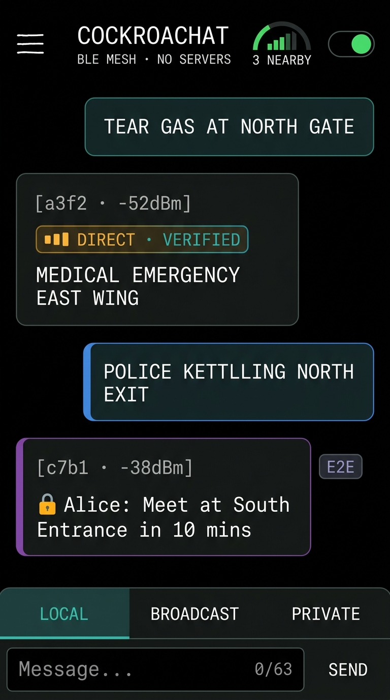
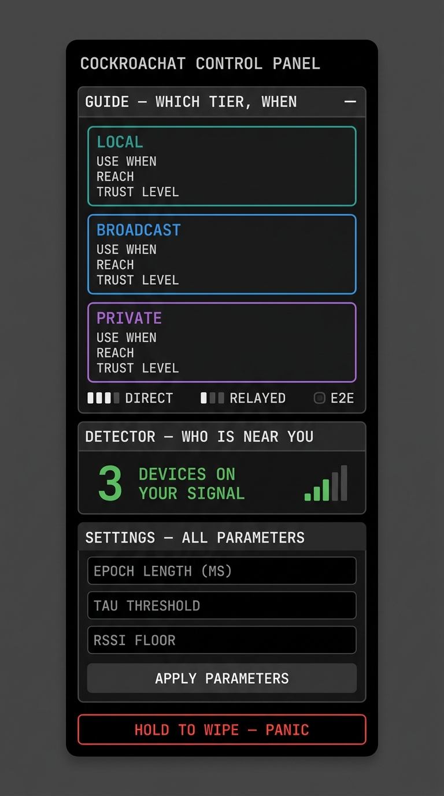

# cockroachat

**Offline Decentralized Mesh Messaging for Protests & Emergencies**

[](mesh-core/)
[-3DDC84?style=flat-square&logo=android)](android/)
[]()
[]()

*Phones relay emergency alerts directly to each other using Bluetooth Low Energy — no cell towers, Wi-Fi routers, central servers, internet access, or user accounts required.*

---

## What is cockroachat?

During protests, civil demonstrations, or natural disasters, cellular networks and Wi-Fi are frequently jammed, monitored, or shut down. 

**cockroachat** turns nearby smartphones into a resilient, self-healing peer-to-peer mesh network. Devices pass short emergency alerts phone-to-phone through the crowd automatically.

### Key Highlights
- **100% Offline & Serverless**: Works entirely over Bluetooth Low Energy (BLE 5.0).
- **Anti-Fake Alert Protection & Spatial Diversity**: Uses physical presence checks ("Proof-of-Co-Presence") and multi-cell spatial diversity so remote actors outside the crowd cannot inject false alerts or fake consensus.
- **Self-Destructing Identity**: Keys auto-rotate continuously. If a phone is seized, past messages and location history remain unrecoverable.
- **Crash-Proof Rust Core**: Every packet is parsed and verified in memory-safe Rust before forwarding, preventing crash-attacks (zip bombs).
- **Danger-Only Alerts**: The public mesh strictly carries danger signals (e.g. teargas, police kettling, medical emergency). Silence is never assumed to mean safety.

---

## Platform Support

| Component | Platform | Details |
|:---|:---|:---|
| **`mesh-core`** | Rust (Core Library) | Contains all protocol parsing, security, cryptography, and relay state machine. |
| **`android`** | Kotlin (Android App) | Single-activity Jetpack Compose app with AMOLED industrial UI, BLE 5.0 Foreground Service, and left settings drawer. |
| **`laptop`** | Rust (Linux Desktop) | Native Linux testing client built on BlueZ for desktop debugging & fixed relay nodes. |

### Android UI (v0.5-unified)

The Android app is a single unified Jetpack Compose activity combining a full-screen messaging interface with a slide-out control panel.

<div align="center">
<table>
<tr>
<td align="center"><strong>Chat — messaging interface</strong></td>
<td align="center"><strong>Drawer — control panel</strong></td>
</tr>
<tr>
<td></td>
<td></td>
</tr>
</table>
</div>

#### Design: AMOLED Industrial

- **True Black Canvas** — `#000000` background with near-black panels (`#0A0A0C`), designed for AMOLED power savings and protest low-visibility use.
- **Monospace Typography** — all text uses monospaced fonts with wide letter-spacing for a tactical, industrial aesthetic.
- **Tier-Colored Accents** — the only saturated colors are the three tier accents: teal (`LOCAL`), blue (`BROADCAST`), purple (`PRIVATE`), plus red for panic.

#### Chat Interface

- **Tier-Colored Chat Bubbles** — messages rendered in a `LazyColumn` with rounded surfaces. Own messages use semi-transparent tier-colored backgrounds with matching borders; received messages use dark panel backgrounds with hairline borders.
- **Trust Meter** — each received message shows a 3-bar signal meter indicating delivery path: `▮▮▮ DIRECT` (sender physically near) or `▮▮ RELAYED` (carried by mesh hops), plus proof type (`VERIFIED`, `CORROBORATED`, or `E2E`).
- **Segmented Tier Selector** — bottom composer includes a color-coded segmented control for switching between `LOCAL`, `BROADCAST`, and `PRIVATE` tiers, with a live byte counter.
- **QR Pairing Dialog** — in-app QR code generation and scanning (via ZXing) for out-of-band X25519 key exchange. No internet or account required.

#### Left Drawer (☰ → Control Panel)

- **GUIDE** — explains when to use each tier, with expandable cards showing use-case, reach, and trust level. Includes a trust meter legend.
- **DETECTOR** — live proximity readout showing how many devices' frames arrive direct (no relay hop), with signal strength bars and epoch stats.
- **SETTINGS** — every tunable parameter: epoch length, beacon floor, τ threshold, RSSI floor, coded PHY, low-latency scan, message repeat epochs.
- **DIAGNOSTICS** — merged rig toolset: export/clear debug log, export measurement JSON, copy/compare KMV sketches (Jaccard distance).
- **PANIC** — hold-to-wipe button that erases all pairing keys, contacts, config, and logs. Irreversible.

#### Security

- **Screenshot Protection** — `FLAG_SECURE` prevents screenshots and screen recording (state-actor threat model).
- **AMOLED Black Status/Nav Bars** — system bars blacked out to match the UI and reduce visual signature.

---

## Architecture & 3-Tier Messaging Model

The protocol uses a 3-tier messaging model to balance latency, crowd coverage, and security:

```
+-------------------------------------------------------------------------------+
|                       3-Tier Messaging Architecture                           |
+-------------------------------------------------------------------------------+

  Tier 1: Immediate Local Broadcast (~30m Radius)
  [ Sender ] ---> (BLE Extended Adv) ---> [ Nearby Nodes ]
   * 1-Hop direct proximity broadcast for immediate danger ground truth.
   * Authenticated by Proof-of-Co-Presence (PoCP) physical witness.

  Tier 2: Multi-Hop Regional Mesh Flood
  [ Sender ] ---> [ Relay Node 1 ] ---> [ Relay Node 2 ] ---> [ Crowd Mesh ]
   * Multi-hop flood re-broadcasted through the crowd.
   * Density-adaptive Trickle algorithm, Frame Hash dedup & TTL limits.

  Tier 3: Encrypted Direct Private Message
  [ Sender ] ================================================> [ Recipient ]
   * End-to-end encrypted pairwise message (ChaCha20-Poly1305).
   * Gated by Proof-of-Work (VDL witness) to prevent network spam.

+-------------------------------------------------------------------------------+
```

### Tier Summary

1. **Tier 1 — Immediate Local Alerts (~30m)**: Instant alerts broadcasted to people right next to you.
2. **Tier 2 — Crowd-Relayed Regional Alerts**: Multi-hop alerts propagated through the mesh. Confidence scales through **Spatial Diversity** (corroboration across distinct physical crowd cells). Re-broadcast frequency automatically adjusts to crowd density via Trickle.
3. **Tier 3 — Encrypted Direct Messages**: Pairwise private messages between trusted contacts with built-in spam protection (Proof-of-Work).

### Real-World Crowd Propagation Examples

#### **Tier 1 Example: Immediate Local Alert (1-Hop / Direct RF Range)**
* **Scenario**: A user at the **North Gate** sees teargas deployed nearby and sends an immediate local alert *"TEAR GAS AT NORTH GATE"*.
* **Flow**:
  1. The frame is generated with `TTL = 0` and `MsgType::LocalImmediate`.
  2. Broadcasted directly via BLE Extended Advertising to all devices within **10–30 meters** (1-hop direct radio range).
  3. **Display**: Displays **instantly** on screens of nearby devices in direct range.
  4. **Propagation**: **Never relayed** by receiving nodes (`relay_decision` returns `None`).
  5. **Beacon Entropy**: Nearby devices collect the frame's sender mark as a physical co-presence witness (`localImmediateMarks`) to generate beacon entropy for key rotation.

#### **Tier 2 Example: Crowd-Relayed Regional Mesh Broadcast (Multi-Hop / Spatial Diversity)**
* **Scenario**: A user at the **North Gate** broadcasts a regional warning *"POLICE KETTLING NORTH EXIT"*.
* **Flow**:
  1. **Origination**: The packet is sent with `TTL = 8` (`MsgType::RegionalPropagated`) carrying the sender's local cell sketch (**Locale A** / North Gate).
  2. **Relaying Without Display**: Nearby phones in Locale A receive the packet. Because the packet has only been seen in 1 locale (`distinct = 1`), phones **do not display it yet** to prevent single-source panic stampedes. Instead, they immediately **relay the packet** over BLE (`relayOnly = true`).
  3. **Mesh Hopping**: The packet hops phone-to-phone across the crowd (taking milliseconds per hop). When it travels 60 meters to the **Central Stage** (**Locale B**), receiving nodes compare the North Gate sketch (**Locale A**) with their own ambient Bluetooth environment (**Locale B**).
  4. **Spatial Diversity Corroboration**: Because Locale A and Locale B have distinct surrounding Bluetooth signals (`Jaccard < τ`), `trust.recordVerification` returns **`distinct = 2`**.
  5. **Display Unlock**: The moment `distinct >= 2`, the anti-panic lock releases, and the alert **instantly pops up on screens across the Central Stage, North Gate, and the rest of the crowd mesh**!
  6. **Loop Suppression**: Originators stop re-broadcasting once they hear their own reflection (`ownFrameHash`), and relay nodes suppress duplicates using a bounded time-decaying deduplication filter (`FfiDedup`).

#### **Tier 3 Example: Encrypted Direct Private Chat (End-to-End AEAD / Oblivious Mesh)**
* **Scenario**: Alice wants to send a private message to Bob *"Meet at South Entrance in 10 mins"* in a dense crowd.
* **Flow**:
  1. **Proof-of-Work & Encryption**: Alice's phone computes a VDL proof-of-work witness (~seconds of CPU) to rate-limit spam and encrypts the 47-byte body using ChaCha20-Poly1305 under their shared pairing key (`pairKey`).
  2. **No Recipient Address on Wire**: The frame contains no recipient address, phone number, or user ID.
  3. **Oblivious Multi-Hop Relay**: Intermediary nodes in the crowd verify the Ed25519 signature and VDL PoW witness. They **cannot read the message or know who it is for**, but they decrement TTL by 1 and relay it across the mesh (`advertiseRelayOnce`).
  4. **Constant-Time Trial Decryption**: As Bob's phone (and all receiving phones) receives the frame, it trial-decrypts the body against all paired contact keys in sequence without breaking early (preventing timing side-channel attacks).
  5. **Delivery**: Bob's phone successfully authenticates the Poly1305 tag and displays `🔒 Alice: Meet at South Entrance in 10 mins`.

---

## Implementation Status (v0)

| Module | Description | Status | Tests |
|:---|:---|:---:|:---:|
| **`codec`** | Zero-allocation fixed 226-byte packet encoder/decoder | Implemented | 9 |
| **`crypto`** | Ephemeral Ed25519 signing, BLAKE3 KDF, X25519 DH, ChaCha20 AEAD | Implemented | 8 |
| **`message`** | Public danger alert & private message frame generator | Implemented | 19 |
| **`pocp`** | Physical proximity verification (Proof-of-Co-Presence) | Implemented | 18 |
| **`beacon`** | Self-clocking key rotation & forward secrecy beacon | Implemented | 13 |
| **`private`** | Tier-3 encrypted direct messaging with epoch nonces | Implemented | 6 |
| **`vdl`** | Proof-of-work cost gate for spam protection | Implemented | 5 |
| **`statemachine`** | Packet processing, relay decisions, and deduplication | Implemented | 12 |
| **`trust`** | Multi-cell crowd corroboration aggregator | In Progress (M6) | 5 |
| **`store`** | Memory-bounded message buffer & instant panic wipe | Implemented | — |
| **`ffi`** | Language bindings for Android (Kotlin) & iOS (Swift) | Implemented | 9 |

---

## Key Security Guarantees

1. **Parse-Before-Forward**: Incoming data is validated in memory-safe Rust before any decision is made to display or relay it.
2. **Fixed 226-Byte Packet**: No variable lengths, no compression, zero room for buffer overflow or zip-bomb attacks.
3. **Danger-Only Public Mesh**: Public broadcasts carry danger alerts only. Nodes cannot broadcast "all clear" signals.
4. **Instant Panic Wipe**: A single command instantly zero-fills and purges all stored state and cryptographic keys.

---

## Developer Quick Start

```bash
# Clone the repository
git clone https://github.com/howtocuddle/cockrochat.git
cd cockroachat/mesh-core

# Run test suite (cryptographic vectors, codec safety, property tests)
cargo test

# Build release binary
cargo build --release

# Run Linux laptop node (requires BlueZ & Bluetooth 5 hardware)
cd ../laptop
cargo run
```

---

## Technical Glossary

This glossary explains technical terms and protocol concepts used throughout `cockroachat`.

### Cryptography & Security Terms

- **BLAKE3**: An ultra-fast cryptographic hash function used for deriving keys, hashing marks, and chaining epoch seeds.
- **ChaCha20-Poly1305**: A high-speed authenticated encryption scheme used to keep Tier-3 private messages secure and tamper-proof.
- **Ed25519**: A public-key signature scheme used to verify message authenticity without revealing private identity.
- **Ephemeral Keys**: Temporary encryption/signing keys that rotate automatically, ensuring past communications remain secure even if a device is later inspected.
- **Forward Secrecy**: A security property guaranteeing that compromised current keys cannot be used to decrypt past session data.
- **Panic Wipe**: An emergency function that immediately zero-fills and purges all in-memory cryptographic keys and stored messages.
- **Proof-of-Work (PoW) / VDL**: Verifiable Delay Lottery — a brief computational task required before sending private messages to prevent spammers from flooding the network.
- **X25519**: A Diffie-Hellman key exchange algorithm enabling two devices to establish a shared secret key out-of-band (e.g. via QR code).

### Mesh Protocol Terms

- **BLE 5.0 Extended Advertising**: A Bluetooth Low Energy standard allowing devices to broadcast larger packets (up to 255 bytes) without requiring Bluetooth pairing.
- **Epoch**: A fixed time window (e.g., 10 seconds in testing, minutes in production) during which devices sample background signals and rotate internal keys.
- **Frame Hash (Dedup Key)**: A unique 16-byte identifier computed from a message's contents, allowing relay nodes to ignore duplicate broadcasts.
- **Jaccard Distance ($\tau$)**: A mathematical formula measuring set similarity. In `cockroachat`, it determines whether two devices share the same physical radio environment.
- **KMV Sketch (K-Minimum Values)**: A compact summary of ambient Bluetooth signals, allowing devices to compare physical surroundings efficiently in memory.
- **LE Coded PHY**: A Bluetooth 5 mode using error correction (S=8) to quadruple radio range, ideal for dense or obstructed crowd environments.
- **Parse-Before-Forward**: The security rule requiring every packet to be fully validated in Rust before being displayed or relayed.
- **Proof-of-Co-Presence (PoCP)**: A cryptographic mechanism verifying that a message originated from someone physically present in the crowd cell.
- **RSSI (Received Signal Strength Indicator)**: A measurement of signal power (in dBm). Closer devices show higher RSSI values (e.g. -40 dBm), while distant devices show lower values (e.g. -80 dBm).
- **Spatial Diversity**: A security mechanism where alert confidence scales based on corroboration from distinct physical geographic cells (ambient RF observations), ignoring remote virtual identity counts (Sybil attacks).
- **Trickle Algorithm**: An epidemic broadcast algorithm (RFC 6206) that adjusts retransmission intervals based on crowd density to conserve battery and bandwidth.
- **TTL (Time-To-Live)**: A hop counter on packets. Each relay decrements TTL by 1; when it reaches 0, the packet stops propagating.
- **UniFFI**: Mozilla's multi-language binding generator used to connect the Rust core cleanly to Kotlin (Android) and Swift (iOS).

---

<div align="center">
<sub>Built for human safety and free expression. No accounts. No servers. No internet. Just mesh.</sub>
</div>
